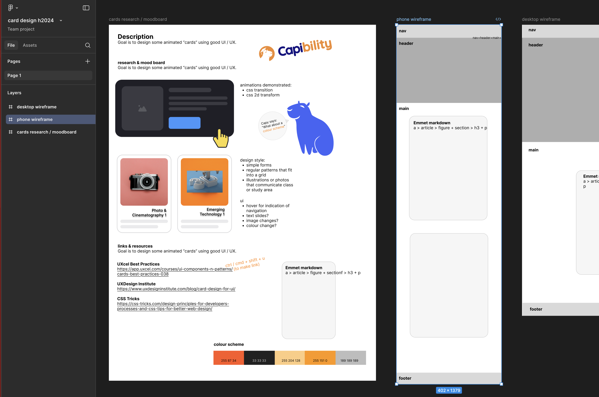
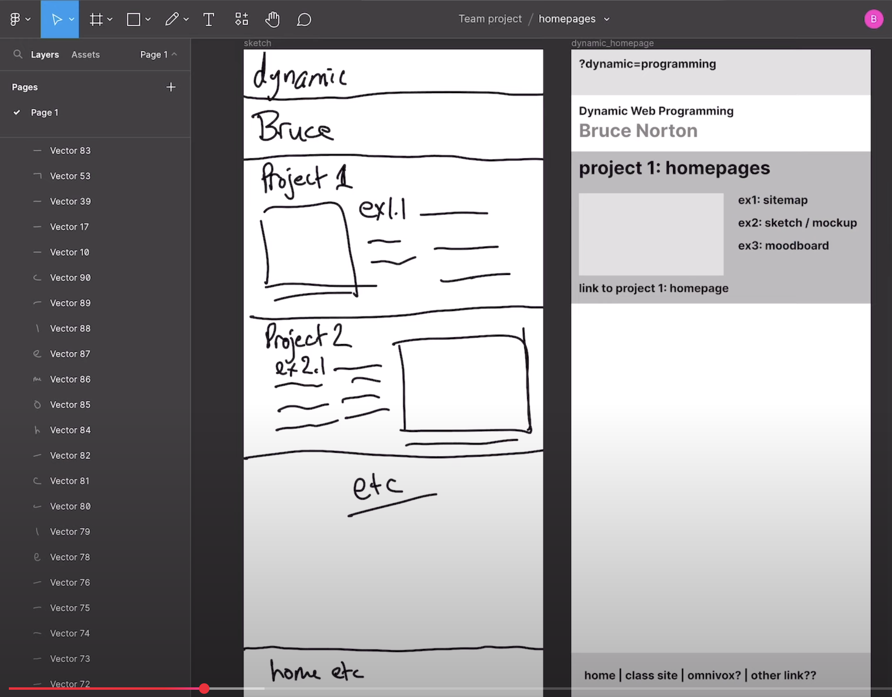

# web-best-practices

## mobile first

Mobile first is a web design and development philosophy.

The concept is straightforward.

When designing websites we design first for the mobile or phone version of the site. And while there are some technical considerations, it's more of a strategy or way of thinking.

## start in your head

- when thinking about your site, picture on your phone
- next, do your design thinking using Figma or similar, starting with mobile

  - find inspo from sites on your phone
  - put a bunch of phone screen captures in your mood boards
  - do layouts, wireframes, mockups using phone #frames

  [Figma mobile-first design](https://www.figma.com/design/e7ps7dEdfjOQDV2uoTrN01/card-design-h2024?node-id=5-22&t=BJ31sHiJyxfVXlLf-0)

  

## plan your html structure

- based on the content of your site, create a grid and use semantic html elements to contain your content i.e.

  - header, nav, main, aside, footer
  - section & article
  - figure, img and figcaption
  - AVOID using div for content

    

    video tutorial [sketch to wireframe](https://youtu.be/q4s9OmUJQUI?si=doLEGJJjfDwFmesm)

    video tutorial [from wireframe to semantic HTML](https://youtu.be/nXQzub4JOJc?si=Tsq4scBgagB5Hjcd)

    bonus video tutorial [weather app design in Figma](https://youtu.be/bAV-_3B8OdY?si=0kiqFuGZoUKpKL_A)

## where does mobile first come from?

Luke Wroblewski was the first to [coin the phrase in articles](https://www.lukew.com/ff/entry.asp?933) and then his book, [Mobile First](https://www.lukew.com/resources/mobile_first.asp)

Check out these articles too:

- [Mobile First Helps with Big Issues](https://www.lukew.com/ff/entry.asp?1117)
- [How to Design Components for Mobile First: a video](https://www.lukew.com/ff/entry.asp?1912)

## if you're doing this, you're doing it wrong

- (max-width: 900px)
- Figma > #frame > starting with > desktop > !!!
