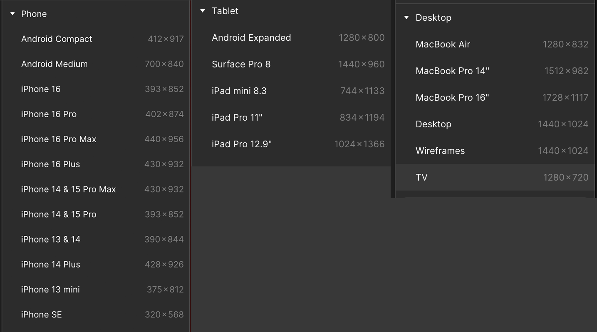

# mobile-first & RESPONSIVE

Before making your design responsive, go back and fine tune your mobile version.

Now go back and do it again.

Seriously though, responsive web design starts with mobile-first then is repsonsive, usually to the width of the screen or viewport.

## grids

Often we use a grid, adding columns as screen widths increase going from 1 column for mobile, 2 columns for tablet and 3 or more columns for desktop, depending on your content.

Specifically we use CSS Grid often with @media queries and grid-template-columns.
Clamp and min-max are also handy, especially for typography. [see MDN grid-template-columns](https://developer.mozilla.org/en-US/docs/Web/CSS/grid-template-columns)

- Mobile devices are usually 320 - 450 pixels wide.
- Tablets are usually 740 - 1280 pixels wide.
- Desktops are usually 1289 plus with the most common being 1920 and 3840 pixels wide.
  

## responsive techniques

Other responsive techniques include:

- grid-auto-columns: 1fr or min-max() [see MDN info](https://developer.mozilla.org/en-US/docs/Web/CSS/grid-auto-columns)
- grid: auto-flow;
- grid: auto-fit;
- grid: auto-fill

Check out [this article from CSS Tricks on Grid Auto Sizing](https://css-tricks.com/auto-sizing-columns-css-grid-auto-fill-vs-auto-fit/)

\*\* MDN = Mozilla Develop Network
